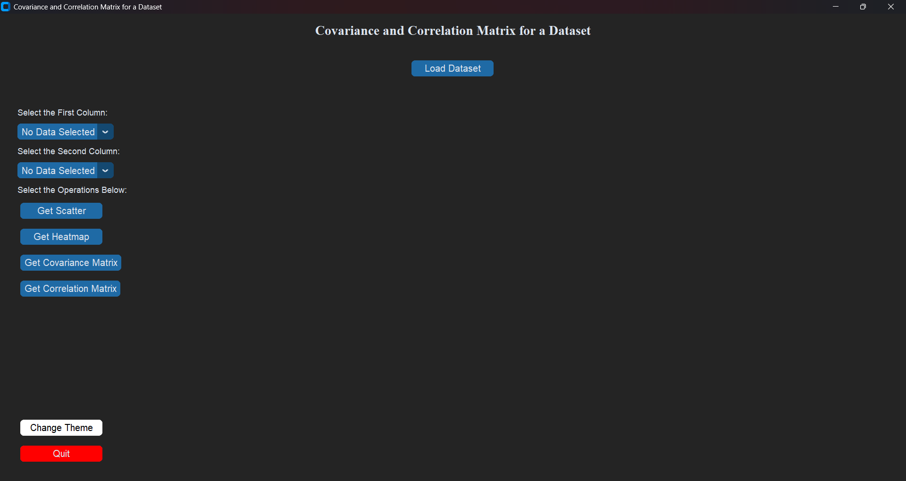

# 📈 Covariance and Correlation Matrix GUI

An elegant Python desktop application to explore covariance, correlation, and visualize relationships in your dataset using **CustomTkinter**, **Pandas**, **Matplotlib**, and **Seaborn**.

---

## ✨ Features

- 🌗 **Theme Toggle** — Switch smoothly between light and dark modes.  
- 📂 **CSV File Loader** — Load any `.csv` dataset and select columns.  
- 🔁 **Scatter Plot** — Visualize relationships between two numeric columns.  
- 🔥 **Heatmap** — Display a correlation heatmap with annotations.  
- 📊 **Covariance Matrix** — View the covariance matrix of numeric features.  
- 📈 **Correlation Matrix** — Explore feature correlations in tabular form.  
- 🧭 **Interactive Matplotlib Toolbar** — Zoom, pan, and save your plots.

---

## 📦 Requirements

Make sure Python 3.x is installed, then run:

```bash
pip install customtkinter pandas matplotlib seaborn
---

## ▶️ How to Run

1. Clone or download the repository.
2. Navigate to the project directory.
3. Run the app using:

```bash
python main.py
```

---

## 🖼️ Screenshot

Here’s what the application looks like in action:



---

## 📄 License

Licensed under the [MIT License](LICENSE) — free for personal and commercial use.

---

## 🙌 Acknowledgements

- [CustomTkinter](https://github.com/TomSchimansky/CustomTkinter)
- [Pandas](https://pandas.pydata.org/)
- [Matplotlib](https://matplotlib.org/)
- [Seaborn](https://seaborn.pydata.org/)
